# Bena | بينا 🛍️

**Bena (بينا)** is an Arabic marketplace web application for buying and selling products within the Gaza Strip.

I built this project as a Front-End application using React, with a focus on creating a simple and practical marketplace experience for Arabic-speaking users. Users can browse products, publish their own listings, save favorites, communicate with sellers, manage orders, and keep track of their marketplace activity.

The entire interface is designed in Arabic with full **RTL support** and is responsive across desktop, tablet, and mobile devices.

> **بينا — من الناس... للناس**

---

## ✨ Features

### 🔐 Authentication

- User registration and login
- Forgot password flow
- Protected routes for authenticated users
- Guest-only routes
- Role-based Admin access

### 📦 Product Marketplace

- Browse available products
- Search for products
- Filter products by category, condition, and location
- Sort product results
- View detailed product information
- Add products for sale
- Edit and delete owned products
- Manage personal product listings
- Track product availability and status

### ❤️ Favorites

- Add and remove products from favorites
- Favorites are stored separately for each user
- Dedicated favorites page

### 🛒 Cart & Checkout

- User-specific shopping cart
- Add and remove products
- Prevent duplicate cart items
- Checkout form with customer and delivery information
- Cash-on-delivery workflow
- Orders are grouped by seller
- Users cannot purchase their own products
- Duplicate active orders for the same product are prevented

### 📋 Orders

Bena includes a buyer and seller order workflow:

```text
Pending → Confirmed → Preparing → Completed
                       ↘ Cancelled
```

Users can:

- View their order history
- View individual order details
- Manage incoming orders as sellers
- Update order status
- Track product availability based on order status

When an order is completed, the related product is marked as sold. If an order is cancelled when applicable, the product becomes available again.

### 💬 Messaging

Buyers and sellers can communicate directly inside the platform.

The messaging system includes:

- Product-related conversations
- Conversation list
- Individual chat pages
- Unread message tracking
- Conversation search

### 🔔 Notifications

Users receive notifications for important marketplace activity, including:

- New messages
- New orders
- Order status changes
- Product-related activity
- Read and unread notification states
- Navigation to related pages directly from notifications

### 👤 User Account

Each user has a personal area where they can:

- View profile information
- Update personal information
- Manage their products
- View favorites
- Follow orders and marketplace activity

### 🛡️ Admin Dashboard

Bena also includes a protected Admin area for managing the platform.

Admin features include:

- Platform statistics
- User management
- Product management
- Order monitoring
- Message monitoring
- Protected Admin routes
- Responsive Admin navigation

### 📱 Responsive RTL Design

The interface was built with Arabic users in mind.

- Full RTL layout
- Desktop support
- Tablet support
- Mobile support
- Responsive product cards and forms
- Reusable UI components
- Responsive user and Admin interfaces

---

## 🛠️ Tech Stack

| Technology       | Usage                            |
| ---------------- | -------------------------------- |
| React            | Building the user interface      |
| JavaScript       | Application logic                |
| CSS              | Styling and responsive design    |
| React Router DOM | Navigation and route protection  |
| Vite             | Development and production build |
| Lucide React     | Interface icons                  |
| React Icons      | Additional icons                 |
| LocalStorage     | Client-side data persistence     |
| Oxlint           | Code linting                     |

---

## 💾 Data & Storage

Bena is currently a **Front-End prototype**, so it does not use a backend server or external database yet.

The application uses browser `LocalStorage` to persist data such as:

- Users and sessions
- Products
- Favorites
- Shopping cart
- Orders
- Messages
- Notifications
- User profile information

Because the data is stored locally, it is specific to the browser and origin where the application is running.

---

## 📂 Project Structure

```text
Bena/
├── public/
│   └── screenshots/
│       ├── bena-home.png
│       ├── bena-products.png
│       ├── bena-product-details.png
│       ├── bena-sell-product.png
│       ├── bena-cart.png
│       ├── bena-checkout.png
│       ├── bena-profile.png
│       ├── bena-my-products.png
│       ├── bena-favorites.png
│       ├── bena-messages.png
│       ├── bena-notifications.png
│       └── bena-mobile-home.png
│
├── src/
│   ├── assets/
│   ├── components/
│   ├── data/
│   ├── pages/
│   ├── utils/
│   ├── App.jsx
│   ├── App.css
│   ├── index.css
│   └── main.jsx
│
├── index.html
├── package.json
├── package-lock.json
├── README.md
└── vite.config.js
```

---

## 📸 Screenshots

### Home

The home page introduces the platform and gives users quick access to search, categories, products, and selling.

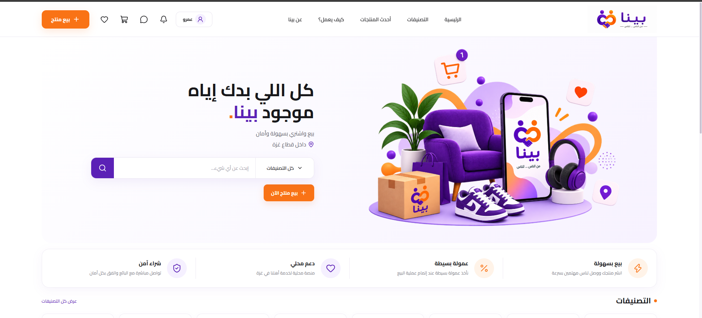

---

### Products

Users can browse the marketplace and narrow down results using search, categories, sorting, and filters.

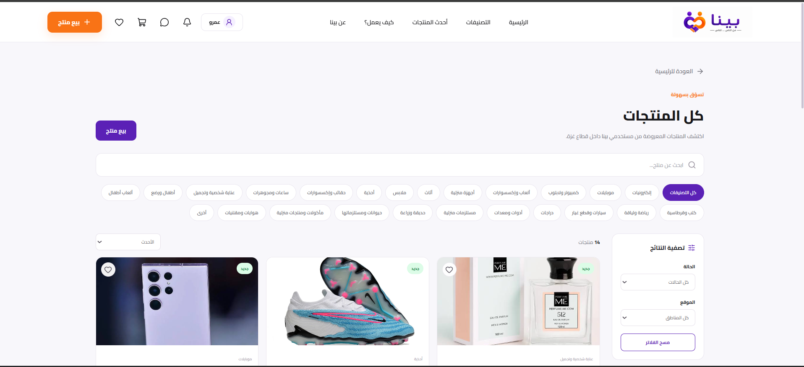

---

### Product Details

Each product has a dedicated page containing its information, seller details, location, status, and available actions.

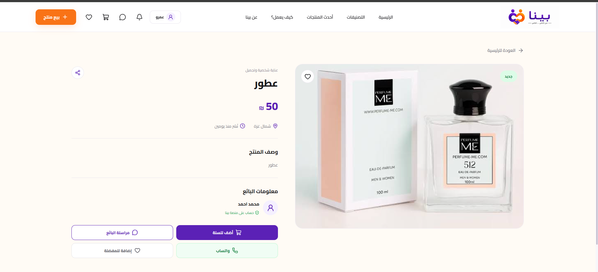

---

### Sell a Product

Users can publish products by adding an image, product information, category, condition, location, and price.

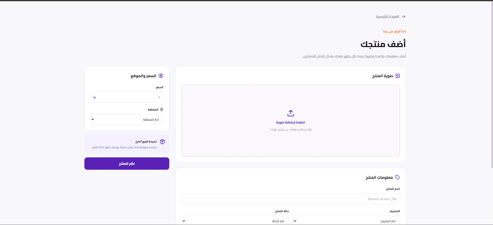

---

### Shopping Cart

Products can be added to a user-specific cart before continuing to checkout.

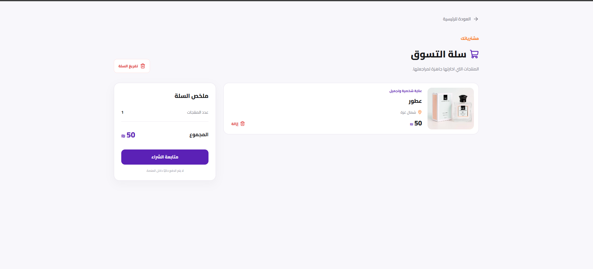

---

### Checkout

The checkout page collects the information needed to complete an order.

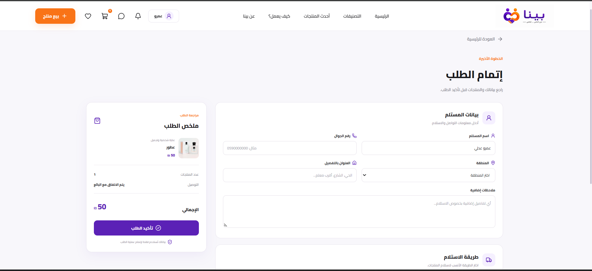

---

### My Products

Sellers have a dedicated page for managing their listings, including viewing, editing, and deleting products.

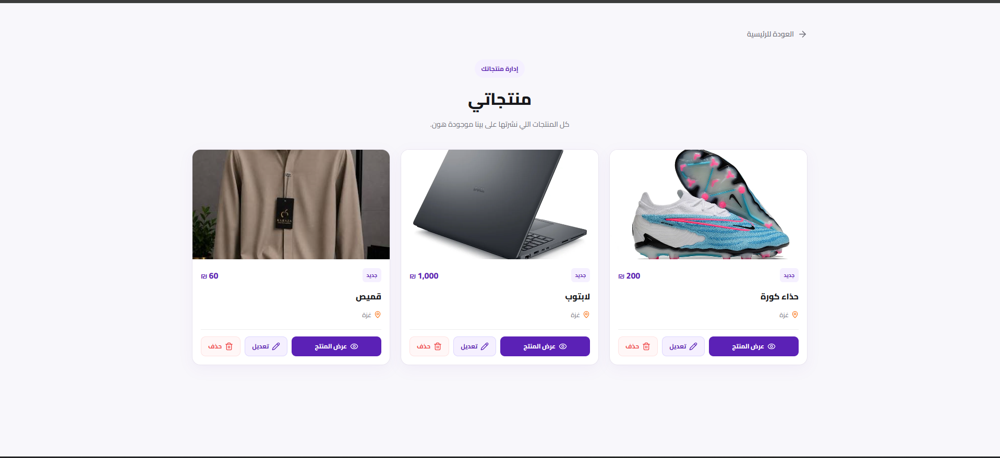

---

### Favorites

Users can save products they are interested in and access them later from their favorites page.

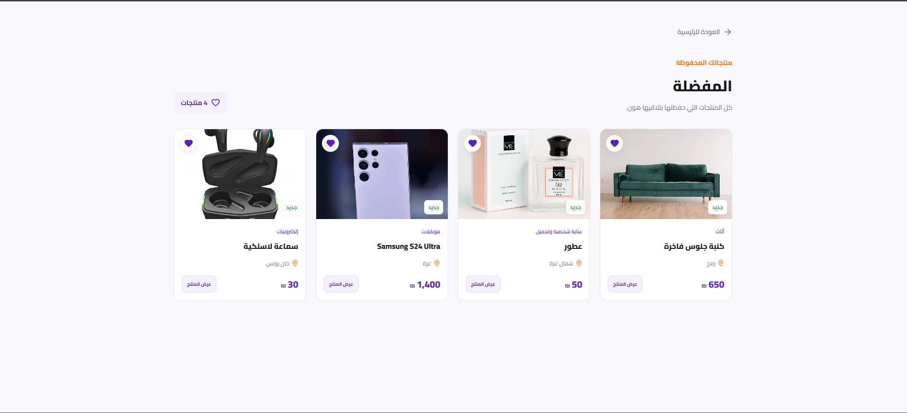

---

### Messaging

Bena includes product-based conversations so buyers and sellers can communicate directly.

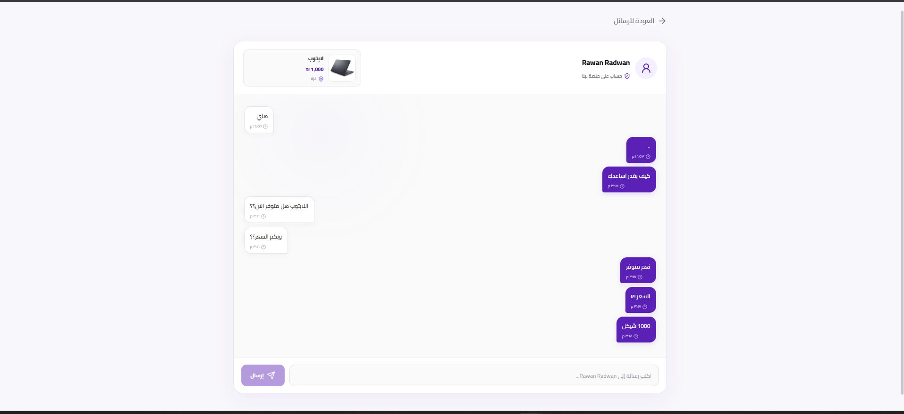

---

### Notifications

Users can keep track of new messages, orders, and other marketplace activity through the notification system.

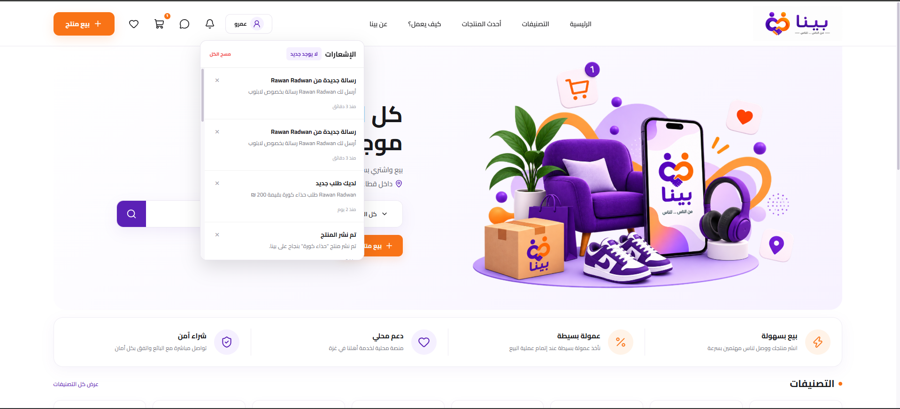

---

### Mobile Experience

The platform is responsive and adapts to smaller screens while keeping the Arabic RTL layout.

<p align="center">
  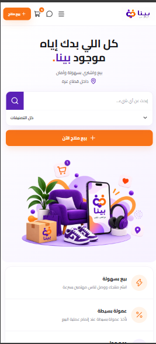
</p>

---

## 🧭 Main Routes

```text
/                       Home
/products               Products
/products/:id           Product Details
/sell                   Sell Product
/favorites              Favorites
/cart                    Cart
/checkout                Checkout
/orders                  Buyer Orders
/orders/:id              Order Details
/seller-orders           Seller Orders
/seller-orders/:id       Seller Order Details
/messages                Conversations
/messages/:id            Messages
/profile                 User Profile
/my-products             User Products
/edit-product/:id        Edit Product

/admin                   Admin Dashboard
/admin/users             Admin Users
/admin/products          Admin Products
/admin/orders            Admin Orders
/admin/messages          Admin Messages
```

---

## 🔒 Route Protection

The application uses three types of route guards:

- `ProtectedRoute` for pages that require authentication
- `PublicRoute` for guest-only authentication pages
- `AdminRoute` for pages restricted to Admin users

---

## 🚀 Getting Started

To run the project locally:

### 1. Clone the repository

```bash
git clone YOUR_REPOSITORY_URL
```

### 2. Open the project directory

```bash
cd bena
```

### 3. Install dependencies

```bash
npm install
```

### 4. Start the development server

```bash
npm run dev
```

Then open the local URL provided by Vite in your browser.

---

## 📜 Available Scripts

Start the development server:

```bash
npm run dev
```

Run the linter:

```bash
npm run lint
```

Create a production build:

```bash
npm run build
```

Preview the production build:

```bash
npm run preview
```

---

## 🔮 Future Improvements

Bena currently focuses on the Front-End experience. Some improvements I would like to add in future versions include:

- Backend REST API
- Database integration
- Server-side authentication and authorization
- Cloud image storage
- Real-time messaging
- Real-time notifications
- Online payment integration
- Production deployment with shared persistent data

---

## 📌 Project Status

**Front-End Prototype — Completed ✅**

The main marketplace experience is implemented, including authentication, product management, favorites, cart and checkout, buyer and seller orders, messaging, notifications, user accounts, and administration.

---

<div align="center">

### Bena | بينا

**من الناس... للناس**

Built with React ⚛️

</div>
